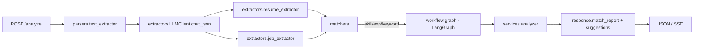

<div align="center">

# 🚀 求职分析智能体

**LangGraph + FastAPI 驱动的简历 ↔ 岗位 JD 智能匹配服务,一键产出可落地的修改建议。**

[](https://www.python.org)
[](https://fastapi.tiangolo.com)
[](https://langchain-ai.github.io/langgraph/)
[](#-切换模型)
[](#-license)

把简历 PDF / DOCX / TXT 和岗位 JD 丢进去,几秒钟得到一份带分数、可解释、可执行的差距分析与改写建议。

[快速开始](#-快速开始) · [核心能力](#-核心能力) · [架构](#-架构) · [API](#-api-参考) · [路线图](#-路线图)

</div>

---

## 📸 运行截图

<div align="center">
  
  <br>
  <sub>工作台:左提交简历 + JD,右侧实时回显匹配报告与建议。</sub>
</div>

> 也可观看 12 秒的端到端流程演示:[`assets/demo.mp4`](assets/demo.mp4)。

---

## ✨ 核心能力

| 能力 | 说明 |
|---|---|
| 📄 **多格式解析** | PDF / DOCX / TXT 统一走 `extract_text`,输入闭环,无需预处理。 |
| 🧠 **结构化抽取** | 简历 / JD 全部经 LLM `chat_json(schema=…)` 强校验,失败自动重试一次。 |
| 🎯 **轻量化匹配** | 技能 / 经验 / 关键词三层规则匹配,Token 消耗低、可解释。 |
| 🪜 **可降级建议** | LLM 抽取失败时,自动 fallback 到基于匹配证据的启发式建议。 |
| 🔁 **LangGraph 编排** | 8 阶段流式工作流,`trace_id` 全链路可观测,同步 / 流式双通道。 |
| 🔌 **Provider 透明** | 默认 DeepSeek v4 Flash,改一行 `.env` 即可切 OpenAI(0 业务代码改动)。 |
| 🛡 **错误分级** | 业务异常(415/413/422/502)与系统异常(500)分别落点,Swagger 友好。 |

---

## 🧱 架构

<div align="center">



</div>

**分层职责**

- `app/parsers/` — 文档 → 文本
- `app/extractors/` — 文本 → 结构化 Pydantic 对象
- `app/matchers/` — 规则匹配(无 LLM 依赖,纯计算)
- `app/workflow/` — LangGraph 状态机 + 节点
- `app/services/analyzer.py` — 业务编排入口
- `app/api/routes.py` — FastAPI 路由

---

## 🚀 快速开始

> **环境约定**:Windows + Miniconda,复用现成的 `fastapi` 环境(Python 3.10.19)。

```bash
# 1. 激活环境
D:\miniconda\envs\fastapi\Scripts\activate.bat

# 2. 安装依赖(首次或新增依赖时执行)
cd <项目根目录>
pip install -r requirements.txt

# 3. 配置环境变量
copy .env.example .env
# 编辑 .env,填入 DEEPSEEK_API_KEY(默认走 DeepSeek v4 Flash)
# 如需切回 OpenAI:LlM_PROVIDER=openai + OPENAI_API_KEY

# 4. 启动服务
uvicorn app.main:app --reload --port 8000
```

不激活 conda 也行,直接走绝对路径:

```bash
D:\miniconda\envs\fastapi\python.exe -m uvicorn app.main:app --reload --port 8000
```

启动成功后:

| 路径 | 用途 |
|---|---|
| <http://127.0.0.1:8000/> | 美化着陆页 |
| <http://127.0.0.1:8000/docs> | Swagger UI(在线调试) |
| <http://127.0.0.1:8000/api/v1/health> | 健康检查 |
| <http://127.0.0.1:8000/api/v1/info> | 服务元信息(provider / model) |
| <http://127.0.0.1:8000/api/v1/analyze> | 简历 ↔ JD 分析(POST) |

---

## 📡 API 参考

### `POST /api/v1/analyze`

**表单字段**

| 字段 | 必填 | 类型 | 说明 |
|---|:-:|---|---|
| `resume` | ✅ | File | 简历文件(PDF / DOCX / TXT),最大 20 MB |
| `job_description` | ◻ | string | JD 文本(与 `job_file` 二选一) |
| `job_file` | ◻ | File | JD 文件(与 `job_description` 二选一) |
| `trace_id` | ◻ | string | 链路追踪 ID,不传则自动生成 |

**响应**

```json
{
  "success": true,
  "code": "ok",
  "message": "分析完成",
  "data": {
    "meta": {
      "resume_chars": 1200,
      "job_chars": 800,
      "used_provider": "deepseek",
      "used_model": "deepseek-v4-flash"
    },
    "match_report": {
      "overall_score": 78.5,
      "skill_gap": { "matched": [], "missing": [], "partial": [], "coverage": 0.8 },
      "experience": { "score": 0.7, "notes": [] },
      "keywords": { "matched": [], "missing": [], "coverage": 0.6 },
      "hard_requirements_gaps": []
    },
    "suggestions": [
      {
        "type": "content",
        "priority": "high",
        "section": "skills",
        "suggestion": "...",
        "reason": "..."
      }
    ]
  },
  "trace_id": "..."
}
```

### `POST /api/v1/analyze/stream`

SSE 流式输出,逐阶段推送进度(8 个 stage + 1 个 `done` 事件),适合长任务前端可视化。

### `GET /api/v1/health`

```json
{ "success": true, "code": "ok", "message": "ok", "data": { "status": "up" } }
```

---

## 🗂 项目结构

```
job/
├── app/
│   ├── main.py                # FastAPI 入口
│   ├── api/routes.py          # 路由层
│   ├── core/                  # 配置 / 日志 / 异常 / 指标
│   ├── models/                # Pydantic 数据模型
│   ├── parsers/               # 文档文本提取
│   ├── extractors/            # LLM 结构化抽取(llm_client + resume/job)
│   ├── matchers/              # 技能 / 经验 / 关键词规则匹配
│   ├── workflow/              # LangGraph 工作流(graph / nodes / state / progress / suggestion)
│   └── services/analyzer.py   # 业务编排入口
├── assets/                    # demo 视频、运行截图
├── uploads/                   # 临时文件目录
├── requirements.txt
├── .env.example
├── Dockerfile
└── 求职分析智能体设计方案.md
```

---

## ⚙️ 切换模型

默认走 DeepSeek v4 Flash,切换 OpenAI 只需改 `.env`:

```env
LLM_PROVIDER=openai
OPENAI_API_KEY=sk-...
OPENAI_MODEL=gpt-4o-mini
```

业务代码不感知 provider,所有 LLM 调用统一经过 `app/extractors/llm_client.py`。

---

## 🧪 设计要点

- **输入闭环** — 文本和文件走同一 `extract_text` 解析器,逻辑零分叉。
- **强校验输出** — LLM 全部走 `chat_json(schema=...)`,字段缺失会重试一次再降级。
- **匹配纯规则** — 技能 / 经验 / 关键词匹配是纯函数,无 LLM 依赖,便于单测和性能分析。
- **可降级** — LLM 失败时,基于匹配证据自动生成启发式建议,API 仍返回 200 + 部分降级标记。
- **可观测** — 全流程 `trace_id`,日志同步输出到控制台 + 文件(见 `app/core/logging.py`)。

---

## 🛣 路线图

- [ ] 简历 ↔ JD 多对多批量匹配
- [ ] 建议生成多轮 LLM 反思(自评 + 改写)
- [ ] 引入本地向量库,支持"先按公司聚类再分析"
- [ ] Dockerfile 多阶段构建 + GitHub Actions CI
- [ ] 前端拆为独立 Vite + React 项目,后端仅作 API

---

## 📄 License

MIT
