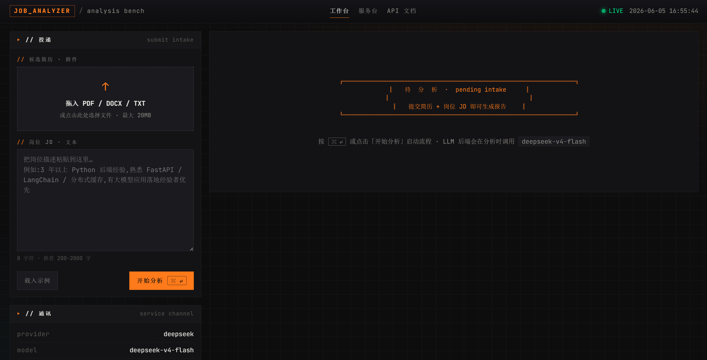
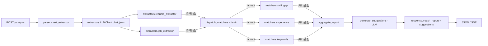

<div align="center">

# 🚀 求职分析智能体

**LangGraph + FastAPI 驱动的简历 ↔ 岗位 JD 智能匹配服务,一键产出可落地的修改建议。**

[](https://www.python.org)
[](https://fastapi.tiangolo.com)
[](https://langchain-ai.github.io/langgraph/)
[](#-切换模型)
[](#-license)

把简历 PDF / DOCX / TXT 和岗位 JD 丢进去,几秒钟得到一份带分数、可解释、可执行的差距分析与改写建议。

[快速开始](#-快速开始) · [核心能力](#-核心能力) · [架构](#-架构) · [API](#-api-参考) · [路线图](#-路线图)

</div>

---

## 📸 运行截图

<div align="center">
  
  <br>
  <sub>工作台:左提交简历 + JD,右侧实时回显匹配报告与建议。</sub>
</div>

> 也可观看 12 秒的端到端流程演示:[`assets/demo.mp4`](assets/demo.mp4)。

---

## ✨ 核心能力

| 能力 | 说明 |
|---|---|
| 📄 **多格式解析** | PDF / DOCX / TXT 统一走 `extract_text`,输入闭环,无需预处理。 |
| 🧠 **结构化抽取** | 简历 / JD 全部经 LLM `chat_json(schema=…)` 强校验,失败自动重试一次。 |
| 🎯 **轻量化匹配** | 技能 / 经验 / 关键词三层规则匹配,Token 消耗低、可解释。 |
| 🪜 **可降级建议** | LLM 抽取失败时,自动 fallback 到基于匹配证据的启发式建议。 |
| 🔁 **LangGraph 编排** | 8 阶段流式工作流,`trace_id` 全链路可观测,同步 / 流式双通道。 |
| ⚡ **并行执行** | 抽取阶段(parse_resume ∥ parse_job)和匹配阶段(skill_gap ∥ experience ∥ keywords)均并行执行,端到端耗时大幅缩短。 |
| 📊 **Token 级进度** | 流式接口推送 LLM token 级实时进度,前端进度条不再黑盒等待。 |
| 🔌 **Provider 透明** | 默认 DeepSeek v4 Flash,改一行 `.env` 即可切 OpenAI(0 业务代码改动)。 |
| 🛡 **错误分级** | 业务异常(415/413/422/502)与系统异常(500)分别落点,Swagger 友好。 |
| 🎯 **面试题预测**(v0.2+) | 分析完成后可一键生成 8–12 道针对性面试题(技术/行为/项目/情景四类),基于分析缓存避免重复解析。 |

---

## 🧱 架构

<div align="center">



</div>

**分层职责**

- `app/parsers/` — 文档 → 文本
- `app/extractors/` — 文本 → 结构化 Pydantic 对象
- `app/matchers/` — 规则匹配(无 LLM 依赖,纯计算)
- `app/workflow/` — LangGraph 状态机 + 节点
- `app/services/analyzer.py` — 业务编排入口
- `app/api/routes.py` — FastAPI 路由

---

## 🚀 快速开始

> **环境约定**:Windows + Miniconda,复用现成的 `fastapi` 环境(Python 3.10.19)。

### 初次运行

```bash
# 1. 激活环境
D:\miniconda\envs\fastapi\Scripts\activate.bat

# 2. 安装依赖
cd <项目根目录>
pip install -r requirements.txt

# 3. 配置环境变量
copy .env.example .env
# 编辑 .env,填入 DEEPSEEK_API_KEY(默认走 DeepSeek v4 Flash)
# 如需切回 OpenAI:LLM_PROVIDER=openai + OPENAI_API_KEY

# 4. 安装并配置 PostgreSQL(面试题预测功能需要)
conda --no-plugins install -n fastapi -c conda-forge postgresql -y --solver=classic
D:\miniconda\envs\fastapi\Library\bin\initdb.exe -D "D:\pgdata" -U postgres -E UTF8 --locale=C
D:\miniconda\envs\fastapi\Library\bin\postgres.exe -D "D:/pgdata" -p 5432   # 前台启动
# 另开终端创建用户和数据库:
D:\miniconda\envs\fastapi\Library\bin\psql.exe -U postgres -h 127.0.0.1 -p 5432 \
  -c "CREATE USER job WITH PASSWORD 'job';" \
  -c "CREATE DATABASE job_analyzer OWNER job;" \
  -c "GRANT ALL PRIVILEGES ON DATABASE job_analyzer TO job;"
D:\miniconda\envs\fastapi\Scripts\alembic.exe upgrade head   # 执行数据库迁移

# 5. 启动服务
uvicorn app.main:app --reload --port 8000
```

### 日常启动

```bash
# 1. 激活环境
D:\miniconda\envs\fastapi\Scripts\activate.bat

# 2. 启动 PostgreSQL(前台进程,关闭终端后需重新启动)
D:\miniconda\envs\fastapi\Library\bin\postgres.exe -D "D:/pgdata" -p 5432

# 3. 启动服务
uvicorn app.main:app --reload --port 8000
```

> PostgreSQL 也可用 Docker:`docker run -d --name job-pg -e POSTGRES_USER=job -e POSTGRES_PASSWORD=job -e POSTGRES_DB=job_analyzer -p 5432:5432 postgres:16-alpine`
> 数据库不可用时主分析流程不受影响,仅面试题预测功能降级。

启动成功后:

| 路径 | 用途 |
|---|---|
| <http://127.0.0.1:8000/> | 美化着陆页 |
| <http://127.0.0.1:8000/docs> | Swagger UI(在线调试) |
| <http://127.0.0.1:8000/api/v1/health> | 健康检查 |
| <http://127.0.0.1:8000/api/v1/info> | 服务元信息(provider / model) |
| <http://127.0.0.1:8000/api/v1/analyze> | 简历 ↔ JD 分析(POST) |
| <http://127.0.0.1:8000/app> | 主分析页面 |
| <http://127.0.0.1:8000/interview> | 面试题预测页面(需 `?trace_id=xxx`) |

---

## 🎯 面试题预测(v0.2+)

分析完成后可一键生成 8–12 道针对性面试题(技术/行为/项目/情景四类),基于 PostgreSQL 缓存避免重复解析。详细设计见 `.trae/documents/PROPOSAL_interview_questions.md`。

| 方法 | 路径 | 说明 |
|---|---|---|
| `POST` | `/api/v1/interview/predict` | 生成面试题(非流式) |
| `POST` | `/api/v1/interview/predict/stream` | 生成面试题(NDJSON 流式) |
| `GET`  | `/api/v1/cache` | 列出所有缓存的分析 |
| `GET`  | `/api/v1/cache/{trace_id}` | 获取单次分析详情 |
| `DELETE` | `/api/v1/cache/{trace_id}` | 删除单次缓存 |

---

## 📡 API 参考

### `POST /api/v1/analyze`

**表单字段**

| 字段 | 必填 | 类型 | 说明 |
|---|:-:|---|---|
| `resume` | ✅ | File | 简历文件(PDF / DOCX / TXT),最大 20 MB |
| `job_description` | ◻ | string | JD 文本(与 `job_file` 二选一) |
| `job_file` | ◻ | File | JD 文件(与 `job_description` 二选一) |
| `trace_id` | ◻ | string | 链路追踪 ID,不传则自动生成 |

**响应**

```json
{
  "success": true,
  "code": "ok",
  "message": "分析完成",
  "data": {
    "meta": {
      "resume_chars": 1200,
      "job_chars": 800,
      "used_provider": "deepseek",
      "used_model": "deepseek-v4-flash"
    },
    "match_report": {
      "overall_score": 78.5,
      "skill_gap": { "matched": [], "missing": [], "partial": [], "coverage": 0.8 },
      "experience": { "score": 0.7, "notes": [] },
      "keywords": { "matched": [], "missing": [], "coverage": 0.6 },
      "hard_requirements_gaps": []
    },
    "suggestions": [
      {
        "type": "content",
        "priority": "high",
        "section": "skills",
        "suggestion": "...",
        "reason": "..."
      }
    ]
  },
  "trace_id": "..."
}
```

### `POST /api/v1/analyze/stream`

SSE 流式输出,逐阶段推送进度(8 个 stage + 1 个 `done` 事件),适合长任务前端可视化。

### `POST /api/v1/interview/predict`

**JSON Body**

| 字段 | 必填 | 类型 | 说明 |
|---|:-:|---|---|
| `trace_id` | ✅ | string | 已完成分析的 trace_id |

**响应**

```json
{
  "success": true,
  "data": {
    "trace_id": "...",
    "interview_questions": {
      "questions": [
        {
          "type": "technical",
          "difficulty": "hard",
          "question": "...",
          "related_skill": "Kubernetes",
          "suggested_answer_direction": "...",
          "follow_up": "..."
        }
      ],
      "summary": "..."
    }
  }
}
```

### `POST /api/v1/interview/predict/stream`

面试题预测的 NDJSON 流式版本,事件格式与 `/analyze/stream` 一致。

### `GET /api/v1/cache`

列出所有缓存的分析记录(分页,`?limit=50&offset=0`)。

### `GET /api/v1/cache/{trace_id}`

获取单次分析的完整缓存数据(含 match_report / suggestions),用于页面状态恢复。

### `DELETE /api/v1/cache/{trace_id}`

删除指定缓存记录。

### `GET /api/v1/health`

```json
{ "success": true, "code": "ok", "message": "ok", "data": { "status": "up" } }
```

---

## 🗂 项目结构

```
job/
├── app/
│   ├── main.py                   # FastAPI 入口 + lifespan + 静态资源
│   ├── api/
│   │   ├── routes.py             # 主分析路由(analyze / stream / health / info)
│   │   └── routes_interview.py   # 面试题预测 + 缓存管理路由
│   ├── core/
│   │   ├── config.py             # provider 感知配置 + DATABASE_URL
│   │   ├── database.py           # SQLAlchemy 2.0 async 引擎 + session 工厂
│   │   ├── cache.py              # 缓存服务(save / load / list / delete)
│   │   ├── errors.py             # AppError 体系 → 4xx/5xx 映射
│   │   ├── logging.py            # 控制台 + 滚动文件日志
│   │   └── metrics.py            # 进程内请求计数/最近日志/平均耗时
│   ├── models/
│   │   ├── resume.py             # ResumeData / ContactInfo / WorkExperience …
│   │   ├── job_requirement.py    # JobRequirement / Requirement …
│   │   ├── suggestion.py         # MatchReport / SkillGapAnalysis / ResumeSuggestion …
│   │   ├── response.py           # ApiResponse[T] / AnalysisResult
│   │   ├── interview.py          # InterviewQuestion / InterviewPredictionOutput
│   │   └── cache.py              # AnalysisCache ORM 模型(JSONB)
│   ├── parsers/
│   │   └── text_extractor.py     # PDF/DOCX/TXT → 文本
│   ├── extractors/
│   │   ├── llm_client.py         # 统一 LLM 客户端(流式 + 回调 + ContextVar/共享变量双轨)
│   │   ├── resume_extractor.py   # 简历结构化抽取
│   │   └── job_extractor.py      # JD 结构化抽取
│   ├── matchers/
│   │   ├── skill_matcher.py      # LLM 语义匹配 + 字面回退
│   │   ├── experience_matcher.py # 规则 + 年限匹配
│   │   └── keyword_matcher.py    # 关键词规则匹配
│   ├── workflow/
│   │   ├── graph.py              # LangGraph 拓扑(Send fan-out/fan-in + 并行抽取)
│   │   ├── state.py              # AgentState + _keep_last reducer
│   │   ├── nodes.py              # 节点实现
│   │   ├── progress.py           # 阶段表 + 线程安全进度回调 + compute_streaming_percent
│   │   └── suggestion_generator.py # 建议生成(LLM + 启发式回退)
│   └── services/
│       ├── analyzer.py           # AnalyzerService(同步 ainvoke + 流式 Queue 模式)
│       └── interview_service.py  # InterviewService(缓存读取 + LLM 面试题生成)
├── alembic/                      # 数据库迁移
│   └── versions/0001_add_analysis_cache.py
├── static/
│   ├── index.html                # 主分析页面
│   ├── app.js / app.css          # 主页面交互 + 暗色玻璃拟态
│   ├── interview.html            # 面试题预测页面
│   └── interview.js / interview.css
├── uploads/                      # 临时文件目录
├── requirements.txt
├── .env.example
├── Dockerfile
└── 求职分析智能体设计方案.md
```

---

## ⚙️ 切换模型

默认走 DeepSeek v4 Flash,切换 OpenAI 只需改 `.env`:

```env
LLM_PROVIDER=openai
OPENAI_API_KEY=sk-...
OPENAI_MODEL=gpt-4o-mini
```

业务代码不感知 provider,所有 LLM 调用统一经过 `app/extractors/llm_client.py`。

---

## 🧪 设计要点

- **输入闭环** — 文本和文件走同一 `extract_text` 解析器,逻辑零分叉。
- **强校验输出** — LLM 全部走 `chat_json(schema=...)`,字段缺失会重试一次再降级。
- **双层并行** — 抽取阶段(parse_resume ∥ parse_job)和匹配阶段(skill_gap ∥ experience ∥ keywords)均通过 LangGraph Send fan-out 并行执行。
- **Token 级进度** — 流式接口推送 LLM token 级实时进度,通过 `loop.call_soon_threadsafe` 桥接工作线程与主线程的 asyncio.Queue。
- **分析缓存** — PostgreSQL + JSONB 持久化分析结果,支持跨页面/跨会话复用,面试题预测零重复解析。
- **可降级** — LLM 失败时自动 fallback 启发式建议;数据库不可用时主分析不受影响,缓存层静默降级。
- **可观测** — 全流程 `trace_id`,节点级耗时日志,日志同步输出到控制台 + 文件。

---

## 🛣 路线图

- [ ] 简历 ↔ JD 多对多批量匹配
- [ ] 建议生成多轮 LLM 反思(自评 + 改写)
- [ ] 引入本地向量库,支持"先按公司聚类再分析"
- [ ] Dockerfile 多阶段构建 + GitHub Actions CI
- [ ] 前端拆为独立 Vite + React 项目,后端仅作 API

---

## 📄 License

MIT
